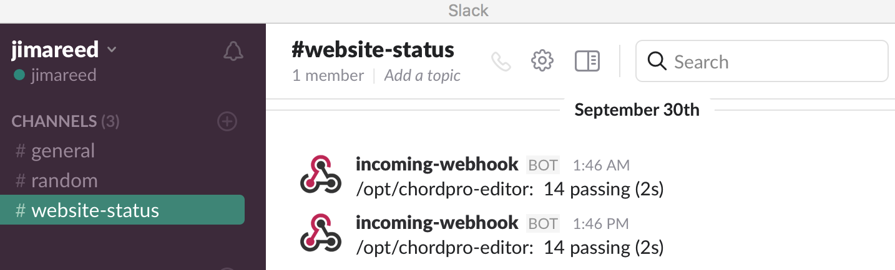

# slack-if-site-down
Verify that your website is running correctly.  Runs system tests every 12 hours and then slacks results.



## setup
```
install project
configure webhook URI and working directory
configure tests
start service
verify setup
```

## install project
{project}=slack-if-site-down
```
curl -sL https://rpm.nodesource.com/setup | bash -
yum install -y nodejs
npm install forever -g
cd /opt
git clone https://github.com/jimareed/{project}
cd {project}
npm install
```

## configure webhook URI and working directory
replace the following lines in server.js.
```
webhookUri = "__replace_url__";    // refer to slack api page for details
dir = "__replace_working_dir__";   // directory where your system tests are run
```

## configure tests
change the following line in server.js to change the test execution command (assumes tests are running on the same server where slack-if-site-down is running).
```
exec('./node_modules/.bin/mocha tests | grep " passing\\| failing"'...
```

## start service
```
forever start -o out.log server.js
forever stop server.js
```

## verify setup
should see messages like the one in the picture above on your slack instance every 12 hours.
